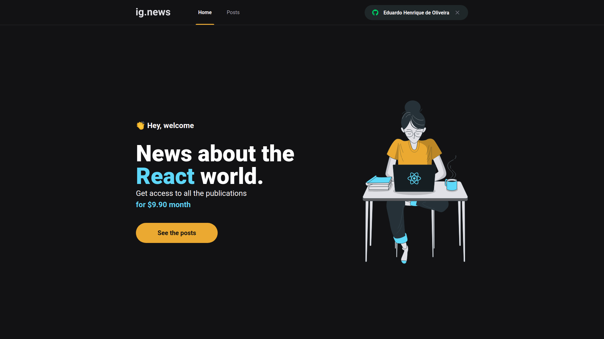
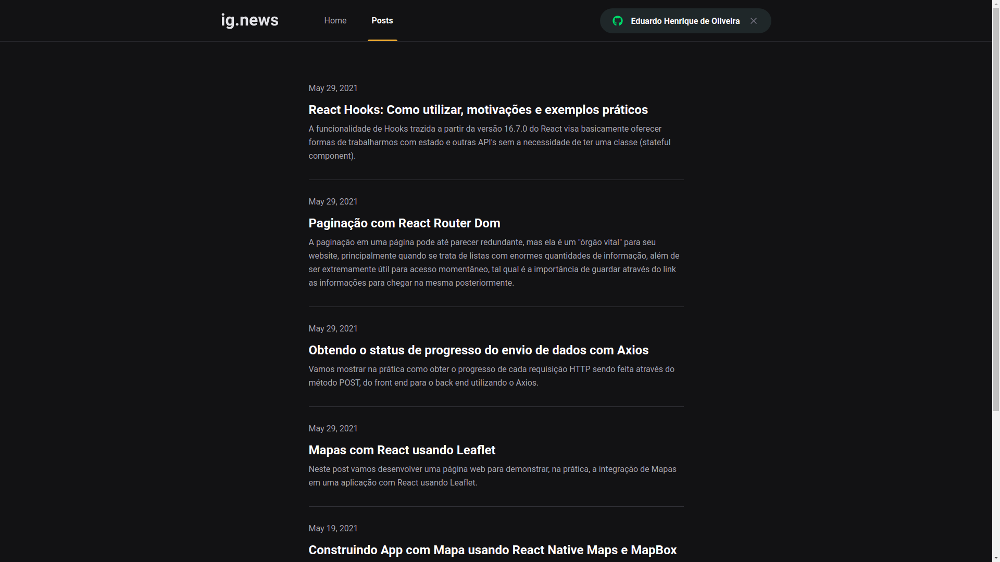
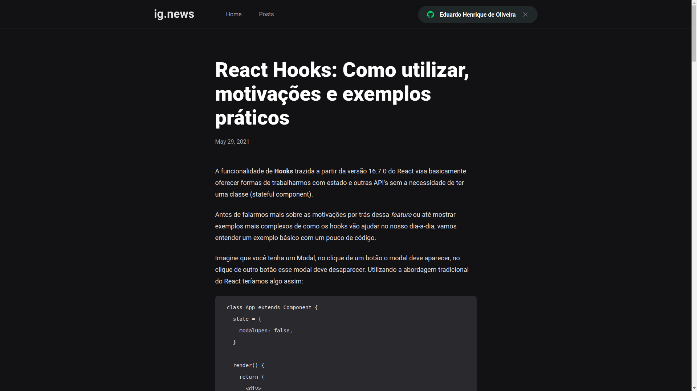

  

<h2 align="center">
  A Next.js blog about React
</h2>

## Layout

**Home**

**Posts**

**Post Content**

    

## About
This project allows you to log in with GitHub, subscribe to the application and have access to blog posts about React. All the posts are created on Prismic CMS, and fetched in the application. The subscription process is handled by the Stripe API, I've implemented a webhook to listen for any changes in the user subscription (e.g. when the subscription is cancelled). FaunaDB is responsible for storing all the logged user and all the subscriptions states.

## Technologies
- Typescript
- React
- Next.js
- Prismic CMS
- FaunaDB
- SCSS
- oAuth